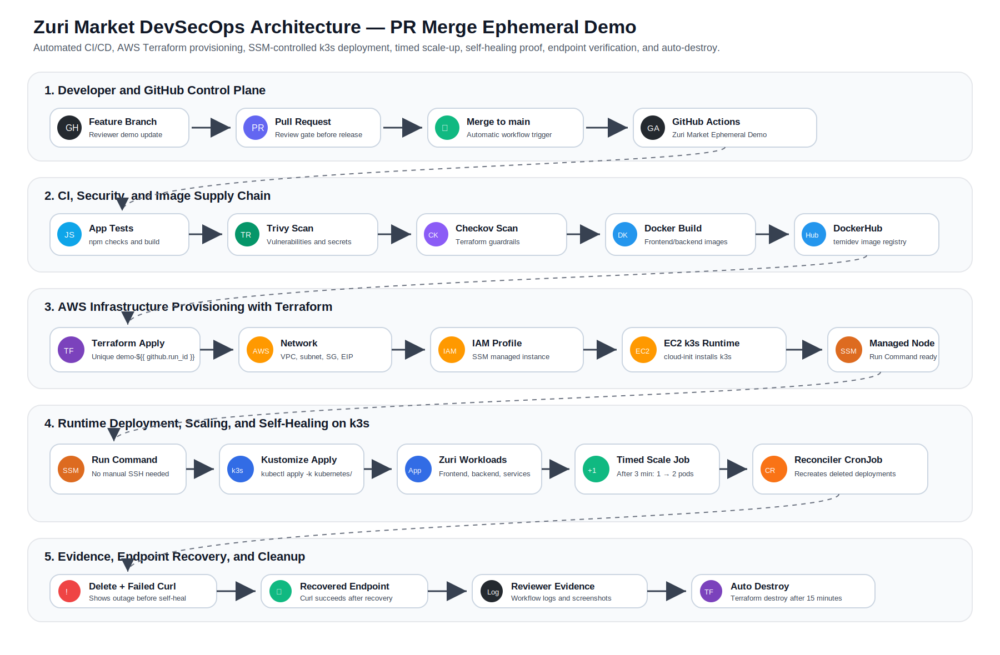

# Zuri Market DevSecOps Capstone

## Executive Summary

Zuri Market is deployed through a secure, automated DevSecOps workflow using GitHub Actions, DockerHub, Terraform, AWS, AWS Systems Manager, and k3s Kubernetes.

The final demo is triggered by a pull request merge into `main`. It provisions temporary AWS infrastructure, deploys the application into k3s using SSM Run Command, proves timed scaling and self-healing, verifies endpoints, and destroys the temporary infrastructure automatically.

---

## Updated DevSecOps Architecture



---

## What This Project Demonstrates

| Capability | Implementation |
|---|---|
| Release trigger | Pull request merge into `main`. |
| CI validation | Backend and frontend install, test, and build checks. |
| Security scanning | Trivy filesystem scans and Checkov Terraform scan. |
| Image supply chain | Docker images built and pushed to DockerHub. |
| Infrastructure as Code | Terraform provisions AWS networking, EC2, IAM, EIP, and security groups. |
| Runtime access | AWS Systems Manager Run Command controls EC2/k3s without manual SSH. |
| Kubernetes deployment | `kubectl apply -k kubernetes/`. |
| Timed scaling | Kubernetes Job scales frontend/backend after three minutes. |
| Self-healing | Kubernetes CronJob recreates deleted deployments. |
| Outage proof | Workflow deletes deployments and shows application curl failure. |
| Recovery proof | Workflow waits for self-healing and shows endpoint recovery. |
| Cost control | Terraform destroy runs automatically after the runtime demo window. |

---

## Repository Structure

```text
zuri-market-infra/
├── .github/
│   └── workflows/
│       ├── devsecops-deploy.yml
│       └── ephemeral-demo.yml
├── docs/
│   └── zuri-market-devsecops-architecture.svg
├── kubernetes/
│   ├── automation-rbac.yaml
│   ├── backend-configmap.yaml
│   ├── backend-deployment.yaml
│   ├── backend-service.yaml
│   ├── deployment-reconciler-cronjob.yaml
│   ├── frontend-deployment.yaml
│   ├── frontend-nginx-configmap.yaml
│   ├── frontend-service.yaml
│   ├── kustomization.yaml
│   ├── namespace.yaml
│   └── timed-scale-job.yaml
├── terraform/
│   ├── compute.tf
│   ├── iam.tf
│   ├── locals.tf
│   ├── networking.tf
│   ├── outputs.tf
│   ├── providers.tf
│   ├── user_data.sh.tpl
│   └── variables.tf
└── README.md
```

---

## Workflow Overview

The final reviewer workflow is:

```text
Pull Request Merge
→ GitHub Actions
→ CI tests and security scans
→ Docker build and push
→ Terraform apply
→ EC2/k3s runtime
→ AWS Systems Manager Run Command
→ Kubernetes deploy
→ Timed scale-up proof
→ Deployment deletion and outage proof
→ Self-healing recovery proof
→ Endpoint verification
→ Auto-destroy with Terraform
```

---

## GitHub Actions Workflows

| Workflow | Trigger | Purpose |
|---|---|---|
| `devsecops-deploy.yml` | Push/dispatch depending on configuration | Normal CI/CD deployment workflow. |
| `ephemeral-demo.yml` | Pull request closed and merged into `main` | Reviewer demo workflow with temporary infrastructure, scale-up, self-healing, and auto-destroy. |

---

## Kubernetes Runtime Automation

### Initial deployment state

The frontend and backend deployments intentionally start with one replica each:

```text
zuri-backend   replicas: 1
zuri-frontend  replicas: 1
```

### Timed scale-up

`kubernetes/timed-scale-job.yaml` waits three minutes and then scales both deployments:

```text
zuri-backend   replicas: 2
zuri-frontend  replicas: 2
```

It also labels pods with:

```text
demo.zuri-market/scaled-after-3-mins=true
```

### Self-healing

`kubernetes/deployment-reconciler-cronjob.yaml` runs every three minutes. If either deployment is missing, it recreates the deployment and labels recreated pods with:

```text
demo.zuri-market/recreated-by-reconciler=true
```

---

## Required GitHub Settings

### Secrets

| Secret | Purpose |
|---|---|
| `AWS_ACCESS_KEY_ID` | AWS access for Terraform and SSM. |
| `AWS_SECRET_ACCESS_KEY` | AWS secret key. |
| `DOCKERHUB_USERNAME` | DockerHub username. |
| `DOCKERHUB_TOKEN` | DockerHub access token. |
| `DEMO_SSH_PUBLIC_KEY` | Optional public key for SSH access during the runtime window. |

### Variables

| Variable | Example | Purpose |
|---|---|---|
| `ALLOWED_SSH_CIDR` | `142.198.247.98/32` | Restricts SSH/k3s access to the demo operator's public IP. |

---

## Local Validation

Before merging the PR that triggers the demo, run:

```powershell
kubectl kustomize .\kubernetes\ > $null
cd terraform
terraform fmt
terraform validate
cd ..
```

Expected Terraform result:

```text
Success! The configuration is valid.
```

---

## How to Run the Final Demo

The demo is not manually triggered. It starts when a PR is merged into `main`.

```powershell
git checkout -b final-reviewer-demo-update
git add .
git commit -m "Finalize reviewer demo automation"
git push origin final-reviewer-demo-update
```

Then:

1. Open a pull request into `main`.
2. Review the changed files.
3. Merge the pull request.
4. Open GitHub Actions.
5. Watch **Zuri Market Ephemeral DevSecOps Demo** run automatically.

---

## Reviewer Evidence to Capture

| Evidence | Where to capture it |
|---|---|
| PR merge trigger | Actions run header. |
| CI and scans | Test, Trivy, and Checkov steps. |
| Docker image build/push | Build and push image steps. |
| Terraform provisioning | Terraform apply step. |
| SSM runtime access | Wait for EC2 in Systems Manager and SSM command ID. |
| k3s readiness | cloud-init and `systemctl is-active k3s` logs. |
| Kubernetes deployment | `kubectl apply -k kubernetes/`. |
| Initial replicas | One backend and one frontend replica. |
| Timed scale-up | Ready replicas >= 2 and scaled labels. |
| Self-healing | Deployment deletion, failed curl, recreated deployments, recovered curl. |
| Auto-destroy | Destroy preannouncement and Terraform destroy complete. |

---

## Optional SSH Demo

The main workflow uses AWS Systems Manager and does not require SSH. Optional SSH is available only if `DEMO_SSH_PUBLIC_KEY` is configured before the PR merge.

Create a local key:

```powershell
ssh-keygen -t ed25519 -f $HOME\.ssh\zuri_demo_key -N "" -C "temi-zuri-demo"
Get-Content $HOME\.ssh\zuri_demo_key.pub
```

Save the public key as the GitHub secret:

```text
DEMO_SSH_PUBLIC_KEY
```

During the workflow run, copy the `Public IP` from the Terraform apply logs and SSH within the 15-minute runtime window:

```powershell
ssh -i $HOME\.ssh\zuri_demo_key ubuntu@<PUBLIC_IP>
```

Useful commands:

```bash
sudo systemctl status k3s --no-pager
sudo k3s kubectl get nodes -o wide
sudo k3s kubectl get all -n zuri-market
sudo k3s kubectl get pods -n zuri-market --show-labels
sudo k3s kubectl get deployments -n zuri-market --show-labels
sudo k3s kubectl get cronjob -n zuri-market
sudo k3s kubectl get jobs -n zuri-market
```

Manual deletion test:

```bash
curl -i http://localhost:30080/api/products
sudo k3s kubectl delete deployment zuri-backend zuri-frontend -n zuri-market --wait=true
sudo k3s kubectl get deployments -n zuri-market || true
curl -i --connect-timeout 5 http://localhost:30080/api/products
sleep 240
sudo k3s kubectl get deployments -n zuri-market --show-labels
curl -i http://localhost:30080/api/products
```

---

## Final Summary

This project demonstrates a complete DevSecOps deployment platform for Zuri Market: PR-based release control, automated testing, security scanning, Docker image delivery, Terraform infrastructure provisioning, SSM-based runtime operations, Kubernetes deployment, timed scaling, self-healing, endpoint validation, and automatic AWS cleanup.
